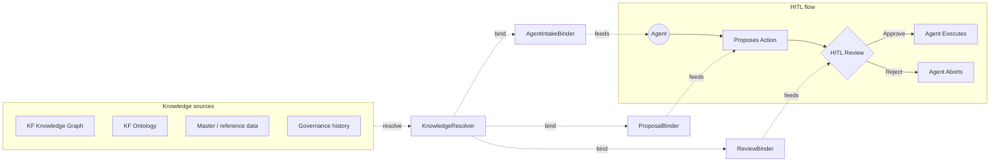

# TCS Agentic AI Platform — HITL Context Framework

**Version:** 0.1 (draft for review)
**Scope:** Standalone HITL service. Context model is wire-compatible with the SC Guardrails developer package and intended to integrate with the KF (Knowledge Fabric) Knowledge Graph Runtime.

---

## 1. Problem

Kevin's HITL diagram shows the canonical pattern: Agent → Proposes Action → HITL Review → {Approve → Execute | Reject → Abort}. As-drawn, it has no opinion on **what knowledge each node sees**. Without that opinion, three things go wrong in production:

1. The agent proposes ungrounded actions because it lacks the policy / scope / master-data slice it needs.
2. The reviewer gets a thin payload and either rubber-stamps or sends it back, neither of which is actually oversight.
3. There is no replayable lineage — auditors cannot reconstruct what knowledge informed each step.

The framework's job is to make the right slice of enterprise knowledge available at each node, in a typed, auditable, transport-agnostic way.

## 2. Five abstractions

| Abstraction         | Role                                                                    |
|---------------------|-------------------------------------------------------------------------|
| `KnowledgeContext`  | Single typed envelope flowing through all four nodes                    |
| `KnowledgeResolver` | Source-side; queries KF / master data / governance history → facts     |
| `StageBinder` (×3)  | Node-side; one per stage (Agent intake, Proposal, Review)              |
| `HITLTransport`     | Sync or async wire — same context contract                             |
| `LineageRecorder`   | Append-only provenance log                                              |

A reviewer surface (`ReviewerSurface` Protocol) renders the context for the human; the reference implementation is a Teams Adaptive Card v1.5.

## 3. Context flow



The same `KnowledgeContext` accumulates across all four stages, then the decision is appended. Lineage events are emitted at every fetch / bind / submit / decide step.

## 4. The contract

### 4.1 KnowledgeRef and KnowledgeFact

Every piece of bound knowledge is a `KnowledgeFact` carrying both the embedded snapshot **and** a `KnowledgeRef` back-link. Truth-source policy is `HYBRID` by default; pure-snapshot or pure-link are available where deployment policy requires.

```python
KnowledgeRef(source="kf:graph", ontology_type="Policy",
             id="POL-TC-OVERRIDE-2026-Q2", version="2026.04",
             uri="https://kf.tcs/policy/...")

KnowledgeFact(ref=…, payload={…}, fetched_by="kf_resolver",
              truth_mode="hybrid")
```

### 4.2 StageContext (one per node)

Each binder produces a `StageContext` named for its stage, holding the facts it bound, the queries it issued (audited verbatim), and a free-form notes field.

### 4.3 KnowledgeContext (the envelope)

```python
KnowledgeContext(case_id, correlation_id, agent_id, action,
                 transport_mode, stages, lineage, ticket, decision)
```

Stages dict is keyed by `Stage` enum: `agent_intake`, `proposal`, `review`, `execute`, `abort`.

## 5. Entry-point binders

Three Protocols, one per node:

- **`AgentIntakeBinder.bind(agent_id, scenario)`** — seeds the agent before it proposes anything. Surfaces active policy, the actor's scope/permissions, applicable ontology classes, the active case file.
- **`ProposalBinder.bind(action)`** — runs after the agent has drafted but before the proposal leaves the agent runtime. Binds master-data references, ontology types, contractual context, deterministic facts the proposal depends on.
- **`ReviewBinder.bind(action, prior_context)`** — assembles the reviewer evidence package. Adds upstream guardrail results, applicable SOPs, similar prior cases, anything else needed for confident review.

Each binder issues `KnowledgeQuery` objects against the resolver registry and returns a `StageContext`.

## 6. Transport

Both modes implement the same `HITLTransport` Protocol:

```python
submit(ctx) -> ReviewTicket
poll(ticket_id) -> ReviewDecision | None
cancel(ticket_id, reason) -> None
```

- **`SyncInProcessTransport`** — invokes the reviewer surface directly, blocks for the response. Used in tests, demos, and co-located reviewer scenarios.
- **`AsyncQueueTransport`** — writes to a durable `OutboundQueue` (Kafka / SQS / Service Bus) and polls a `DecisionStore` (Redis / DB / KV). Production default.

The `KnowledgeContext` serializes to JSON via Pydantic; both transports carry the same serialized form, so async durable storage can be replayed into a sync test harness without translation.

## 7. Reviewer surface

Reference implementation: `TeamsAdaptiveCardSurface` (Adaptive Card v1.5). The card body is built section-by-section:

- Headline (action type + case ID)
- Proposed action (FactSet)
- Stage sections (Agent intake, Proposal, Review) — each fact rendered with its source/version subtitle and click-through to the live source URL
- Lineage tail (last eight events, collapsible)
- Three actions: Approve, Reject, Need more info

The same payload renders in a web fallback. To swap to ServiceNow, ADO work item, or a custom UI, implement `ReviewerSurface` with a different `render()` / `parse_decision()`.

## 8. Lineage

`LineageEvent` is append-only, sequence-numbered, and carries `knowledge_refs` for every event. Default `InMemoryLineageRecorder` is fine for tests; production replaces with a write to the governance audit store (the same store that backs SC-CU-007 in the SC Guardrails work).

Replayability: given a `case_id`, the framework can reconstruct exactly which facts were available to which actor at which stage, with version pins.

## 9. Integration with SC Guardrails

The framework is wire-compatible with `tcs_sc_guardrails.AgentAction`. When `GuardrailRunner` returns a `PENDING_APPROVAL` decision (e.g., from SC-TC-007, SC-PP-007, SC-LN-002), the platform router:

1. Calls `HITLContextService.open_case(...)` if no case exists yet.
2. Calls `attach_proposal(ctx, action)` with the action that triggered approval.
3. Calls `submit_for_review(ctx)` — review binder pulls in the originating `GuardrailResult.evidence` as a `KnowledgeFact`.
4. On `collect_decision(...)`, routes back to the agent runtime: approve → resume action; reject → emit abort.

The integration example in `examples/sc_guardrails_integration.py` walks through SC-TC-007 (Trade override approval) end-to-end.

## 10. Open questions / next iteration

- **Reviewer surface** defaulted to Teams; confirm or substitute.
- **Truth-source policy** defaulted to hybrid (snapshot + link). Some regulated facts may require pure-link to avoid stale data exposure — flag those at the ontology-class level.
- **KF resolver implementation** — depends on KF Knowledge Graph Runtime API surface (KF-TRD-002). Stub interface is in `connectors`; production wiring is a follow-on.
- **Multi-reviewer / quorum** — current contract assumes single reviewer per ticket. If two-person rule or quorum is required for critical guardrails (SC-PP-006 quality holds, SC-FC-007 authority caps), extend `ReviewTicket` and `ReviewDecision` with a quorum policy.
- **Section 2 of the SC Guardrails source doc (Risk & Operational Resilience)** is still missing — same dependency as the SC Guardrails build.

## 11. File map

```
hitl-context/
├── src/tcs_hitl_context/
│   ├── models.py         # KnowledgeContext + all typed primitives
│   ├── protocols.py      # Resolver, binders, transport, surface, lineage
│   ├── service.py        # HITLContextService orchestrator
│   ├── transport.py      # Sync + async transports
│   ├── lineage.py        # InMemoryLineageRecorder + helper
│   └── surface_teams.py  # Teams Adaptive Card v1.5 surface
├── examples/
│   └── sc_guardrails_integration.py   # SC-TC-007 end-to-end
└── docs/
    ├── framework.md             # this document
    └── context_flow.mermaid     # flow diagram
```
